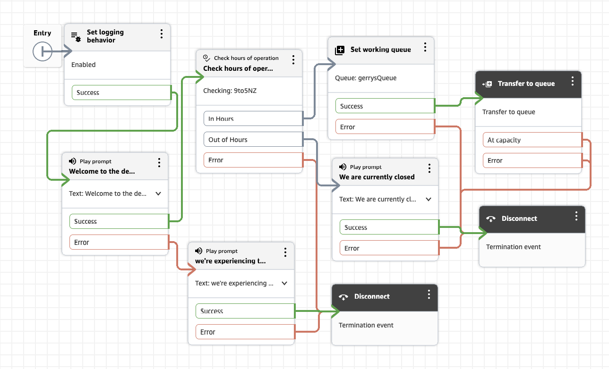

# aws_connect
Learning about aws connect

## System design considerations

- **Multi-channel routing:** voice vs chat vs (eventually) messaging share queues/routing profiles but have different flow entry points — design routing profiles and queues so they're channel-agnostic where possible.
- **State/session handling across Lambda invocations:** Connect passes attributes between flow blocks; Lambda calls are stateless — where does session context live if a customer moves from IVR to a Lex bot to a human agent?
- **Guardrails on AI-driven paths:** what happens when the AI/Lex intent classification has low confidence — fallback to menu/human, not silent failure.
- **Observability:** Connect has native contact trace records (CTRs) + CloudWatch; production troubleshooting relies on these, so it's worth wiring at least basic CloudWatch alarms even in a learning build.
- **Environment separation:** dev/test Connect instances are genuinely separate AWS resources (not just a variable flip) — costs and phone number provisioning matter even at hobby scale, so plan for a single low-cost dev instance rather than parallel environments.
- **Security/IAM boundary:** Lambda execution roles scoped tightly per function (CRM lookup Lambda shouldn't have Connect admin permissions), matching an enterprise's "secure, maintainable solutions aligned to architecture, privacy" line.

## Cost picture for the AI stage (Bedrock/Q in Connect)

Since cost matters, here's what I found current as of today:

| Service | Free tier | Realistic hobby cost beyond it |
| --- | --- | --- |
| Amazon Connect (chat) | 500 free chat messages/month (12 months) as part of free tier | ~$0.004–0.01/message after |
| Lambda | Always-free tier: 1M requests/month, permanently (not just 12 months) | effectively $0 at your scale |
| Amazon Lex | 10,000 text / 5,000 speech requests per month, 12 months | pennies if you exceed it |
| Amazon Q in Connect | No dedicated free tier | $0.0015/chat message, $0.008/voice min — testing 100 messages ≈ $0.15 |
| Bedrock (raw model calls) | No free tier | cheap small models (e.g. Nova Lite) run ~$0.06/million input tokens — a day of experimentation is cents, not dollars |

## Region choice: us‑west‑2 (Oregon)

Amazon Connect is only available in a subset of AWS regions. When AWS automatically selects **us‑west‑2**, it’s because:

- It’s one of the primary regions for Connect
- It has full feature coverage (telephony, Contact Lens, Lex, etc.)
- It’s one of the lowest‑cost telephony regions globally
- It’s commonly used for tutorials, labs, and training

For my learning project, **us‑west‑2** is ideal.

## Creating a Connect Instance

- Launch Amazon Connect (Start Here)
  - I begin by opening the Amazon Connect console to create your first instance.
  - > AWS Console → Services → Amazon Customer Care (was Connect)

- Create the Connect Instance (Required)
  - > This instance holds all contact centre configuration: users, queues, flows, telephony.

> Instance creation wizard → Identity → Admin → Telephony → Data storage → Review

- Choose **Add an instance**
- Provide an `Access URL` (for example, `your-connect-instance`)
- Create an administrator account with secure credentials
- Accept default telephony settings (inbound/outbound enabled)
- Accept default S3 data storage settings
- Click `Create instance`

### Create Business Hours

Business hours allow flows to behave differently depending on time of day.

Routing → Hours of operation
- Go to **Routing → Hours of operation**
- Create a new schedule (e.g., 9am–5pm NZST)
- Save the hours for later use in flows

### Create a Queue

Queues determine where calls are routed and which agents can receive them.

Routing → Queues
- Go to **Routing → Queues**
- Create a queue (for example, `demo-queue`)
- Assign your business hours
- Leave other settings default for now

### Build a Contact Flow

Contact flows define the customer experience: greetings, menus, routing.

Routing → Contact flows → Create
- Go to **Routing → Contact flows**
- Create a new flow (e.g., `DemoFlow`)
- Add a Play prompt block: “Welcome to the demo contact centre.”
- Add a Set working queue block → choose `demo-queue`
- Add a Transfer to queue block
- Save & Publish the flow

Then refine some more and see attached

### Testing and Logs

- Create a test by creating a new interaction in the **Design** tab
- **Settings Tab**: The channel is set to Chat and Flow has selected DemoFlow.
- Save & Publish the flow

- For logs check `CloudWatch`
 - `Set Logging Behaviour` is enabled, **Logging is off by default per flow** and would explain empty log streams

 ### Debugging

 - Wire in a sample business-hours value into the `Check Hours of Operation` block
 - Test Case: log trace is clean — Play prompt → Check hours of operation (false/out of hours) → closed prompt → Disconnect, exactly as designed.
 - Error branches to a new **Play prompt** ("We're experiencing technical difficulties, please try again later") → **Disconnect**

 ### Testing Behaviour

 test-run implementations complete synchronously against the flow logic without needing a human agent to pick up (that's plausible given my tests showed a "Passed" result on its own, with no agent interaction required).

 ## Summary

 - instance → hours-gated routing → chat flow → CloudWatch flow logs demonstrates the Connect fundamentals
 
