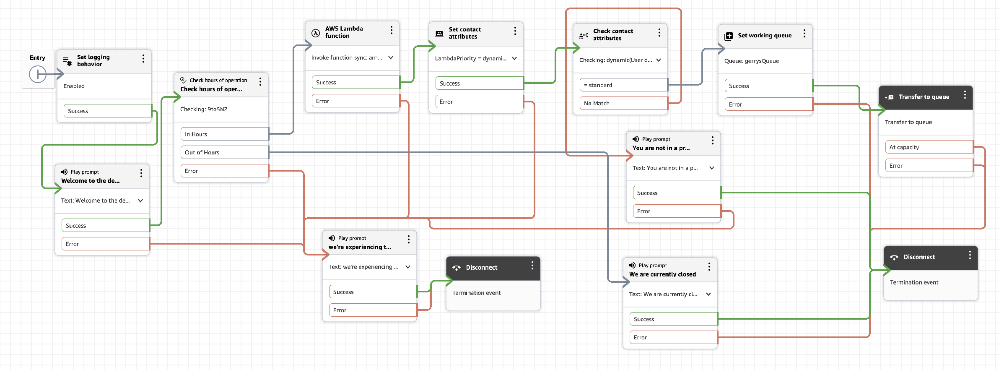

# Obtaining attributes

## Summary so far

Python Lambda mid-flow is genuinely complete. 

I've covered the full loop: 
- function creation, event/response contract, sync invocation, response validation, the permission gotcha (and understanding why it happened, not just fixing it blindly), error-branch wiring, attribute storage, and branching logic — with both branches actually proven via real test observations rather than just visual wiring, Further explainations are provided

## Using Check contact attributes block

**Check contact attributes block** — the branching counterpart to what I've just built. I'm currently storing `LambdaPriority` but not yet acting on it. The diagram shows the completed step.

Adding a Check block right after Set contact attributes (branching on `LambdaPriority = standard` vs. some other value) turns this from "enrichment" into genuine `routing logic`

The end workflow is shown below




From the diagram above, the "Check contact attibutes" is added after "Set Contact attributes" which is added after the "AWS Lambda function" which calls the updated lambda function code as shown below:

```python
import json
import random

def lambda_handler(event, context):
    # First run: just log everything so you can see the real event shape
    print(json.dumps(event))

    contact_data = event['Details']['ContactData']
    channel = contact_data.get('Channel', 'UNKNOWN')
     # Randomly choose between standard and vip
    priority_lambda = random.choice(["standard", "vip"])

    # Simple self-contained logic - no external API/DB calls, so $0 beyond
    # the Lambda invocation itself (which is inside the always-free tier)
    result = {
        "greeting": "Hello from Lambda",
        "channelSeen": channel,
        "priority": priority_lambda
    }

    return result  # must be a flat dict - see "Verify the function response" below
```

- So a `priority` of standard or vip is randomly returned

## DemoFlow-attributes block settings

In DemoFlow-attributes my settings are:

- AWS Lambda function
  - Action: Invoke lambda
  - Function Arn (set Manually) - (obtained from Lmbda function)
  - Execution Mode: Synchronous
  - Timeout: 4
  - Response validation: String Map
- Set Contact Attibutes
  - Adding Attribute:
  - Namespace: User Defined
  - Key: LambdaPriority
  - Set Dynamically
    - Namespace: External
    - Key: priority
- Get Contact Attributes
  - Namespcae: User Defined
  - Key: LambdaPriority
  - Conditions to check:
    - condition: Equals
    - Key: standard
  (Other Condition)
    - No Match

### What about "Error" checking on "Check Contact attributes" block

**The Check contact attributes block genuinely has no Error branch** — that's correct behavior, not something missing from my setup. It only ever produces one branch per condition you define, plus a default **No match branch**. There's no Error output to wire, so nothing to add there.

This makes sense once you know the underlying mechanism (the API-level action is literally called "Compare," and its only defined failure mode is `NoMatchingCondition` — which is exactly what No Match represents). Unlike Lambda or Play prompt, there's no external dependency here that could fail at runtime (no network call, no timeout) — it's a pure in-memory comparison against data already on the contact, so there's nothing left over for a separate Error case to represent.

### Where does the No Match Play prompt's Success go?

So the full picture for this branch: **Check contact attributes → No Match → "You are not in a priority queue" (Play prompt) → Success → Disconnect**, with the Play prompt's own Error branch routed to my existing technical-difficulties handler like the rest of the other flows.

### Lambda function details

The request and response performed consisted of:

request
```json
{
  "Details": {
    "ContactData": {
      "Channel": "CHAT"
    },
    "Parameters": {}
  },
  "Name": "ContactFlowEvent"
}
```

response
```json
{
  "greeting": "Hello from Lambda",
  "channelSeen": "CHAT",
  "priority": "standard" OR "vip"
}
```