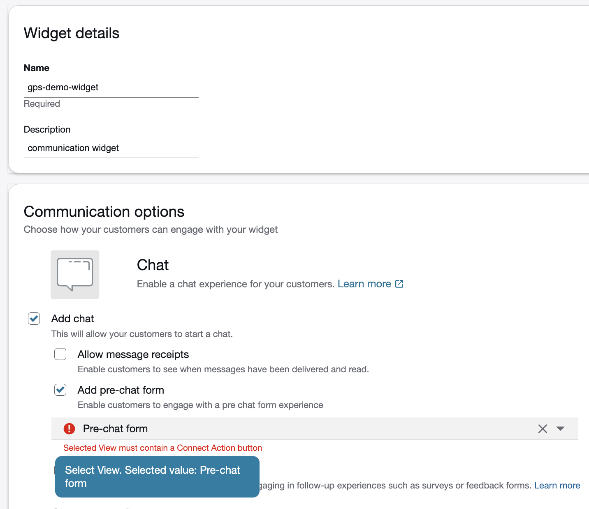
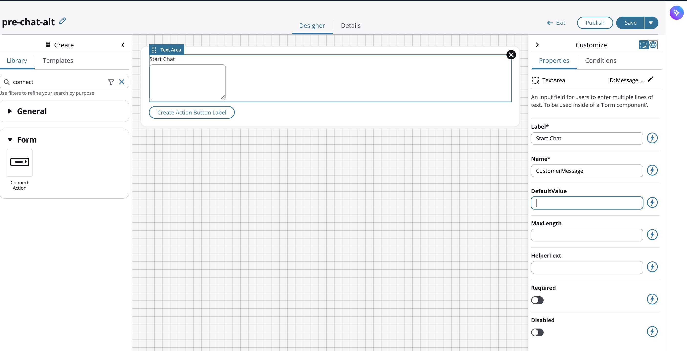
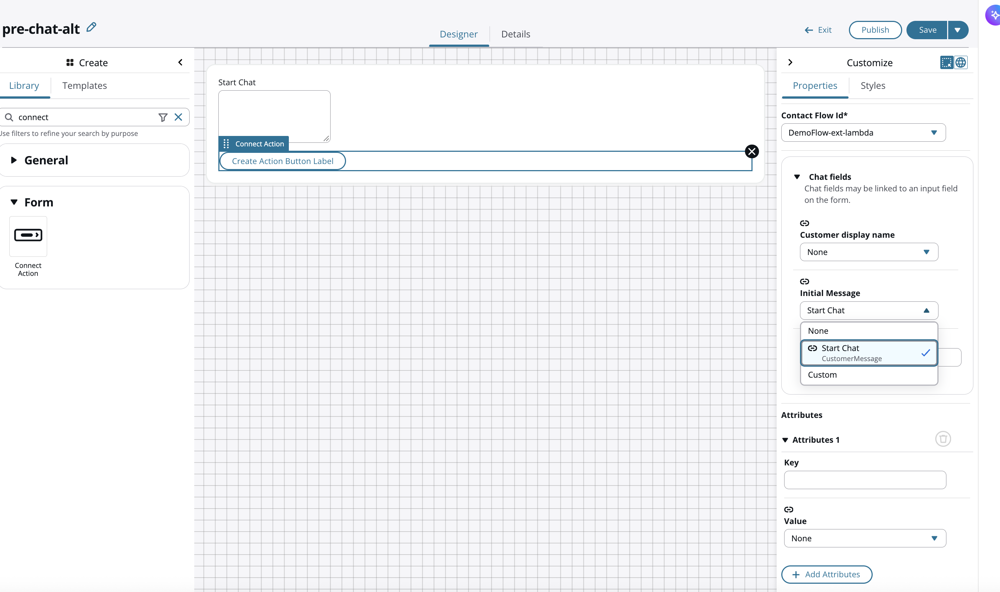

## Customer Widget

Previously `CustomerMessage` was used in test cases to simulate an initial message from the customer to describe their issue, and the lambda prompt rubic would determine if the CustomerMessage was "standard" or "vip" priority.

However, to wire in a customer simulation, a customer widget is required as in **Test chat**, Amazon Connect does not give you a field to type an initial customer message.
To generate a real `$.Media.InitialMessage`, you must use the **chat widget** itself.

`$.Media.InitialMessage` is only populated by the customer’s first inbound chat message.

The **Test chat** tool does not simulate a customer utterance.
It only simulates routing and agent-side behavior.

So Test chat **cannot** produce `$.Media.InitialMessage`.

### Creating a widget

Open the Communication Widgets section

- This is where chat entry points are created in the new Connect UI.
- `Amazon Connect console → Channels → Communication widgets`

Create a new widget

- You must create a widget before any chat entry point or flow can be used.
- Click Create widget
- Enter a name such as `gps-demo-widget`
- Select **Chat** as the channel type

Allowed domains  

| Scenario	| Domain to add |
| --- | --- |
| Testing locally	| http://localhost or http://127.0.0.1 |

- Important: You must include protocol

Then **Save** and a generated script is provided

- Embed script into an html file locally, e.g. `index.html`
```html
<!DOCTYPE html>
<html>
  <body>
    <!-- Paste the entire Connect widget script here -->
  </body>
</html>
```

- Serve the file from localhost
- Use python by running
```python
python3 -m http.server 8080
```
- Then open via an incognito window
`http://localhost:8080/index.html`

You should now see the **actual chat widget** appear.

#### What the script actually does

The script:
- Loads the Connect chat widget JS
- Initializes the widget
- Connects to your instance
- Creates a real customer chat contact
- Sends the first message as `Media.InitialMessage`
- Routes through your contact flow
- Invokes the Lambda 

It is not something you modify — you simply embed it.

## Issues

It turned out that CustomerMessage was blank and was passing "" to Lambda, even when typing a message in the widget.

To debug:
- Ensure Contact flow is configured as a **Chat** flow
- Your widget is pointing to the correct flow
- The customer message can be inputted into widget

So why is `$.Media.InitialMessage` still blank?

- Because of flow timing.

**Amazon Connect only populates** `$.Media.InitialMessage` **AFTER the first customer message arrives.**

But the flow invokes Lambda before the customer sends anything.

The flow sequence is:
1. Welcome message
1. Check hours
1. Invoke Lambda
1. Only after that does the customer type their message

So at the moment Lambda runs, `$.Media.InitialMessage` is still: "" (blank)

- I added a hard-code message into the Lambda block of the Contact flow and ran the widget again which worked by pushing the hard-coded message into Lambda and getting a return response via Bedrock.

- However, need a dynamic setup, so a **pre-chat form** was investigated.

## Pre-chat form

Choosing the correct template from `Views` menu selection

You must choose:
- Form Example

This is the only template that produces a customer‑side form compatible with the widget.

The other templates (Screen Pop, Wrap‑up, Disposition, Payment, etc.) are agent‑only.

Build your form
- Add a field:
- Field type: Text Area (Text Area must be inside a Section)
- Label: “What can we help you with today?”
- Attribute name: CustomerMessage
- Remove everything you don’t need
- Later discovered that this setup didn't work

1. Save the view and publish
1. Attach the View to your widget
1. Re‑copy the widget script
This step is mandatory.

Every time you change:
- The widget
- The view
- The flow

You must re‑copy the script and paste it into your index.html.

test via `http://localhost:8080/index.html` in an incognito window

### Issues on pre-chat form

Unable to bind Text Area to a Connect attribute
- Supposed to be able via Integrations option but Connect option is not provided (more on this later)
- There was also an issue hooking in a pre-chat form from within the customer widget as shown in the following 

### How to resolve identified issues

- First issue was the form, only one type of form could be used
- Originally, I used a "Form Template" which turned out to be too ridgid in that the "submit" button could not be removed.
- Given that, the cleanest fix is probably to **not fight the template** — start over from a blank view instead:
- Create a new View, but this time build it from the **Library** tab rather than **Templates**.
- Drag in a plain **Form** component as the container.
- Drag a **Text Area** inside it, and set its `Name` to `CustomerMessage` (or whatever key I want) like I already have.
- Drag in the **Connect Action** component as the only button-type element, set `ConnectActionType` to `StartChatContact`.
- Save → Publish.




