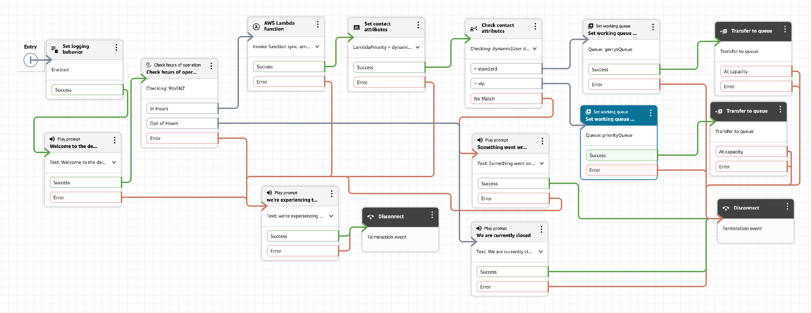

# DemoFlow Contact Queues

The final output of showing two separate queues handling calls determined from a lambda function.

Here, I have adapted the same-agent/priority-ordering approach as the right choice — it's the core Connect concept, cleanly demonstrable with one routing profile -  (queue priority is a per-routing-profile property, not a queue property) rather than just "I made two queues."

## Steps to create the two queues using one routing profile

My lambda function randomly provides a priority of "vip" or "standard" - these settings wire into a `priorityQueue` and `gerrysQueue` respectively.

So, practically, to make `priorityQueue` real:

1. **Create the queue** (Routing → Queues → Create queue) — same as `gerrysQueue`, needs its own hours of operation (i reused `9to5NZ`).
1. **Attach it to my existing routing profile** `gerrys-rp`, alongside `gerrysQueue`.
1. Set `priorityQueue` to **Priority 1** and `gerrysQueue` to Priority 2 (or lower) within that routing profile's queue list.

With that in place: if an agent is Available and there's a contact waiting in `priorityQueue`, they get offered that one first — even if a `gerrysQueue` contact has been waiting longer. That's the actual, observable "priority" behaviour — not a property of the queue object itself, but of how the routing profile ranks it.

## Two design choices worth knowing about

1. **Same agent pool, different priority order** — simplest, and the standard mechanism for "VIP customers get answered first by the same team."
1. **Separate agent pool entirely** — a routing profile that only includes `priorityQueue`, assigned to specific agents (e.g. senior staff) — used when priority customers need specialized handling, not just faster turnaround. More setup, not needed for what I'm demonstrating.

## Wiring setup

Start off by just adding a second condition to the same block of "Check contact attributes" rather than building a new one.

1. Open the **Check contact attributes** block.
1. Click **Add another condition.**
1. Set it to **Equals**, value `vip`.
1. Save.

I'll now see three output branches on the block: **standard, vip**, and **No Match** as shown in the above diagram.

**Wiring:**

- `vip` → new **Set working queue** (pointing at `priorityQueue`) → new **Transfer to queue**
- `standard` → my existing Set working queue/Transfer to queue path (already pointing at `gerrysQueue` — no change needed)
- `No Match` → keep as-is ("You are not in a priority queue" → Disconnect)

## Debugging

- Initially looking at Cloudwatch logs, I noted vip was incoporated from Lambda and the`arn` value was the only way to link to `priorityQueue` in co-ordination with **Contact Search** described next
  - The solution was to provide a block name on each of the **Set working queue** blocks, eg. "Set working queue - priorityQueue", which was used as the **identifier** in the cloudwatch logs

### What Contact Search is

**It's under Analytics and optimization → Contact search** in the left nav (separate from Routing). It's a UI over Connect's contact records — every contact gets a record with its channel, timestamps, queue history, disconnect reason, and (for chat) the actual transcript, searchable by Contact ID, date range, channel, status, and more.

### Mock testing

- Test settings are - Channel: Chat, Flow: Select given flow
- Desinger, Create new interaction and incorporate an Event e.g. "Test Started"
- Then add an **Action block**
  - Add an Action, using the following Key:Value pairs
    - Action: Mock Resource behaviour
    - Resource Type: "Hours of Operation"
    - Target Resource: `9to5NZ`
    - Option (Select the override option): Check "Mock Response"
    - Operation: "Check Hours of operation"
    - Response (Select the response to override): "Out of hours"
- Save and then publish
- Verify via Cloudwatch - you should see out of hours message - "We are currently closed as you reached us out of hours. Please call back later"
- Repeat Response for "Error" and Save/Publish
- Again via Cloudwatch, you should see "Error" - "we're experiencing technical difficulties, please try again later"
