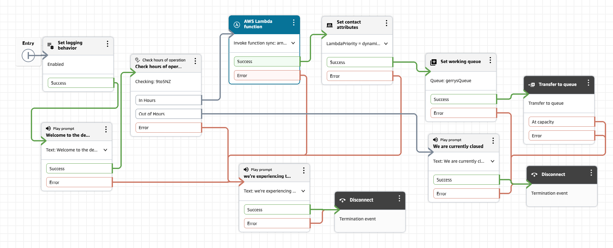

# Lambda for Contact Center

## Purpose

- Lets a contact flow call out to your own code mid-conversation, to fetch/compute something the flow itself can't (a lookup, a calculation, a decision).

## Lambda Function setup

- We'll use **the Lambda invocation should just log the full event** so we see the real shape from a test instance.

- Code used

```python
import json

def lambda_handler(event, context):
    # First run: just log everything so you can see the real event shape
    print(json.dumps(event))

    contact_data = event['Details']['ContactData']
    channel = contact_data.get('Channel', 'UNKNOWN')

    # Simple self-contained logic - no external API/DB calls, so $0 beyond
    # the Lambda invocation itself (which is inside the always-free tier)
    result = {
        "greeting": "Hello from Lambda",
        "channelSeen": channel,
        "priority": "standard"
    }

    return result  # must be a flat dict - see "Verify the function response" below
}
```

**NOTE** - the response must be a flat object (no nested JSON) if you leave response validation as STRING_MAP, and every value must serialize to alphanumeric/dash/underscore-safe text. Keep it simple like above and you're fine.

## Testing the Lambda

Do this from the **Lambda console**, separately from Connect, before ever touching the flow:

1. Open your function → (Code already added as above and deployed)  →  Test tab → Create new test event.
1. Paste in a JSON payload matching what your handler expects. Since your code does `event['Details']['ContactData']` and `.get('Channel', 'UNKNOWN')`, the minimum viable test event is:

```json
{
  "Details": {
    "ContactData": {
      "Channel": "CHAT"
    },
    "Parameters": {}
  },
  "Name": "ContactFlowEvent"
}
```

1. The expected response should be"
```json
{
  "greeting": "Hello from Lambda",
  "channelSeen": "CHAT",
  "priority": "standard"
}
```

### Key Mechanics for Lambda

- **Two-part permission model** — the flow block just needs the ARN to know what to call; the instance-level **Flows → AWS Lambda** section is what actually grants Connect permission to invoke it (via a Lambda resource-based policy scoped to your instance ARN). Missing this step = 403 AccessDeniedException at runtime, not a config-time error.
- **Execution mode: Synchronous** — the flow pauses and waits for the Lambda to return before continuing. Timeout (you set 4s, max 8s) governs how long it'll wait before giving up and routing down Error.
- **Response validation: String Map vs JSON** — String Map requires a flat, non-nested response of key-value strings; JSON allows nesting. Your handler returns a flat dict, so String Map was the correct match.
- **Two branches: Success / Error** — and critically, **every branch must be wired to something or the flow won't publish.** I hit this directly (the "Failed to publish" error) and fixed it by routing Error to a dedicated "technical difficulties" path — a good habit, since it also cleanly *separates system failure from expected business state* (like Out of Hours).
- **The event payload** (`Details.ContactData`, `Details.Parameters`) is Connect's standard contract into my function — same shape regardless of what the Lambda does internally.
- **The response surfaces in the flow logs as** `ExternalResults` — visible proof of what came back, independent of what you do with it downstream.

## Set contact attributes block

**Purpose:** takes a value from somewhere (a Lambda response, a stored customer input, another attribute) and writes it into the contact's attribute set, where it persists and can be referenced by any block for the rest of the flow — and appears in contact records/reporting.

### Key mechanics for Set contact attributes block

- **Namespace + Key pairing** is how you pull the value in: `Namespace: External, Key: priority` pulls specifically from the most recent Lambda's response (the doc's note that External always refers to the most recent invocation matters if you ever chain multiple Lambdas).
- **Destination:** `Namespace: User Defined, Key: LambdaPriority` — this is the name my own flow logic will reference going forward (e.g. `$.Attributes.LambdaPriority` in a later block).
- My log confirms the actual write: `"ContactFlowModuleType": "SetAttributes", "Key": "LambdaPriority", "Value": "standard"` — this is now a durable fact about the contact, not just a transient variable.

```json
{
    "ContactId": "xx-xx",
    "ContactFlowId": "xx",
    "ContactFlowName": "DemoFlow-lambda",
    "ContactFlowModuleType": "SetAttributes",
    "Identifier": "xx",
    "Timestamp": "2026-07-29T03:18:43.880Z",
    "Parameters": {
        "Value": "standard",
        "AddAttributeToRelatedContact": "false",
        "Key": "LambdaPriority"
    }
}
```

- **Why bother storing it rather than referencing** `$.External.priority` **directly downstream?** 
  - **Durability and auditability** — an attribute survives across multiple later blocks and shows up in reporting, whereas a direct External reference only reflects the most recent Lambda call and isn't part of the contact record.

## DemoFlow-lambda settings

In DemoFlow-lambda my settings are:

- AWS Lambda function
  - Action: Invoke lambda
  - Function Arn (set Manually) - (obtained from Lmbda function)
  - Execution Mode: Synchronous
  - Timeout: 4
  - Response validation: String Map
- Set Contact Attibutes
  - Adding Attribute:
  - Namespace: User Defined
  - Key: LambdaPriority
  - Set Dynamically
    - Namespace: External
    - Key: priority

##  DemoFlow-lambda design flow

The design flow for lambda is shown below:


